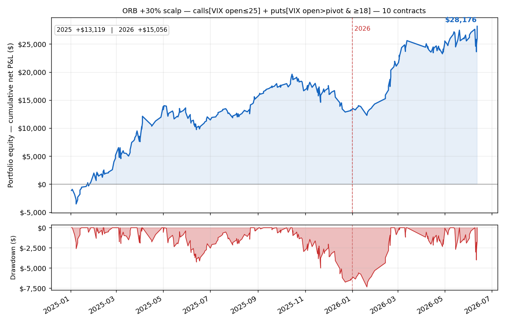

> **Disclaimer:** Not Financial Advice, educational purposes only

# ORB + VWAP Filter Bot

## Overview

A fully automated 0DTE options trading bot based on the Opening Range Breakout (ORB) strategy.

> **Note:** the VWAP entry filter is **disabled by default** (`VWAP_FILTER_STRICT = False`).
> An ablation over 2024–2026 showed it removes <3% of trades — it is redundant with the
> OR-high breakout — and is net-neutral for calls / net-negative when trading both
> directions. VWAP is still computed and shown on the dashboard. Set the flag to `True`
> to restore the original VWAP-confirmed entries.

## Strategy

- **Opening Range**: Captures 15-minute range (9:30-9:45 AM EST)
- **Entry**: Breakout above range high (calls) OR below range low (puts). *(VWAP confirmation optional — off by default.)*
- **Exit**: CPR-based profit taking at 50%, 100%, 150%
- **Stop Loss**: Hybrid approach - 50% of entry price
- **Position Management**: 3 contracts, scale out 1/3 at each profit level
- **No Reversal**: Exits on opposite breakout, waits for re-entry

## Key Features

- **Timezone**: EST (9:30 AM - 1:00 PM EST trading window)
- **Opening Range**: 9:30-9:45 AM EST
- **Trading Hours**: 9:45 AM - 1:00 PM EST (post-range)
- **VWAP Filter**: Optional, **off by default** (computed for the dashboard; not used to gate entries)
- **Risk Management**: Max $1,000 daily loss, 15-min re-entry cooldown
- **State Persistence**: Fully stateless design with JSON state file
- **HTML Dashboard**: Auto-updating dashboard with range/VWAP metrics
- **Cron Ready**: Runs every minute via shell script

## Entry Conditions (ALL must be true)

1. Post-opening range (after 9:45 AM EST)
2. Trading hours (9:45 AM - 1:00 PM EST)
3. Range successfully captured
4. Breakout detected:
   - **Calls**: price > range_high *(AND price > VWAP only if `VWAP_FILTER_STRICT = True`)*
   - **Puts**: price < range_low *(AND price < VWAP only if `VWAP_FILTER_STRICT = True`)*
5. No existing position
6. Risk limit not exceeded ($1,000 max daily loss)
7. Not in re-entry cooldown (15 minutes after stop out)

## Exit Conditions

1. **CPR Profit Taking**: Scale out 1/3 at 50%, 100%, 150% profit
2. **Hybrid Stop Loss**: 50% of entry price
3. **Opposite Breakout**: Exit all if price breaks opposite side of range
4. **End of Day**: Force close all positions at 1:00 PM EST

## Configuration

All settings in `orb_vwap_filter.py`:

```python
# Opening Range Period (EST)
OPENING_RANGE_START_HOUR = 9
OPENING_RANGE_START_MINUTE = 30
OPENING_RANGE_END_HOUR = 9
OPENING_RANGE_END_MINUTE = 45

# Trading Hours (EST)
TRADING_START_HOUR = 9        # 9:45 AM EST
TRADING_START_MINUTE = 45
TRADING_END_HOUR = 13         # 1:00 PM EST
TRADING_END_MINUTE = 0

# Position Settings
CONTRACTS_PER_TRADE = 3
OTM_STRIKES_OUT = 3

# Risk Management
MAX_DAILY_RISK = 1000
STOP_LOSS_PERCENT = 50
HYBRID_STOP_ENABLED = True
POSITION_REVERSAL_ALLOWED = False

# CPR Profit Levels
CPR_LEVEL_1_PROFIT_PERCENT = 50
CPR_LEVEL_2_PROFIT_PERCENT = 100
CPR_LEVEL_3_PROFIT_PERCENT = 150

# Re-entry Wait
REENTRY_WAIT_MINUTES = 15
```

## Files

- **orb_vwap_filter.py**: Main bot (800+ lines)
- **orb_vwap_filter.sh**: Cron runner script
- **backtest_vwap_filter.py**: Historical backtest on real 0DTE option prices
- **BACKTEST_2025_2026.md**: 2025 & 2026 backtest results and methodology
- **bot_state.json**: State persistence (auto-generated)
- **bot.html**: HTML dashboard (auto-generated)
- **orb_vwap_filter.log**: Execution logs (auto-generated)

## Backtest (2025 & 2026)

A **look-ahead-free** historical replay on **real QQQ 0DTE option 1-minute prices** —
signals on the completed bar's close, fills at the next bar's open (the −50% stop is a
real resting order). See [BACKTEST_2025_2026.md](BACKTEST_2025_2026.md). Summary (per
3-contract position, before commissions/slippage):

| | 2025 (full year) | 2026 (Jan–Jun 12) |
|---|---:|---:|
| Trades | 488 | 159 |
| Win rate | 25.4% | 27.0% |
| Total P&L | +$2,892 | −$3,426 |
| Profit factor | 1.08 | 0.80 |

Positive-skew, low-win-rate (~1 in 4): ~65% stop out at −50%, but winners average ~3×
losers. **Profitable in 2025 but only thin/near-breakeven after realistic costs; loss-
making in 2026** — the edge lives in a few trend days.

### Recommended config — portfolio equity curve (10 contracts)

The configuration grid search ([GRID_SEARCH.md](GRID_SEARCH.md)) found a CPR-free
**+30% scalp** (`OTM-1 · +30% target · −75% stop · OR ≥ $1 · 3 trades/day`) that is
net-positive (after commissions) in both years. The directional split is:

- **Calls** — taken every day on an upside opening-range breakout.
- **Puts** — taken **only on days where VIX opens above its pivot** (a risk-off open,
  known at 9:30 → no look-ahead; VIX pivot = `(prevH+prevL+prevC)/3`, from
  [`vix_daily.csv`](vix_daily.csv)). Unfiltered puts lose every year; this gate turns the
  short side from a drag into a contributor.

Sized at **10 contracts** (daily-loss cap scaled to $10,000 to match size), net of
$0.65/contract/side — reproduce with [`equity_curve.py`](equity_curve.py):



| | 2025 | 2026 (Jan–Jun) | Combined |
|---|---:|---:|---:|
| **Net P&L** | **+$10,188** | **+$8,764** | **+$18,952** |
| Trades / days | 299 / 197 | 103 / 71 | — |
| Day win rate | 61% | 62% | — |

Adding the VIX-gated puts lifts the combined 2-year result from **+$14,539** (calls only)
to **+$18,952** — it roughly doubles 2025 (the puts' best year) while modestly diluting
2026 (a near-vertical uptrend where even gated shorts struggle).

⚠️ Still a **long-biased** strategy harvesting the 2025–26 QQQ uptrend; the VIX gate adds a
short side only on risk-off days. It was ≈ breakeven-to-negative in 2024 and would likely
underperform in a sustained down market. Validate out-of-sample before risking capital.

## Quick Start

```bash
# 1. Navigate to bot directory
cd /path/to/ibkr/orb_vwap_filter

# 2. Test setup
./test_orb_vwap_filter.sh

# 3. Run manually
python3 orb_vwap_filter.py

# 4. View dashboard
open bot.html

# 5. Set up cron
crontab -e
# Add: * * * * * /path/to/orb_vwap_filter/orb_vwap_filter.sh
```

## Monitoring

```bash
# Watch logs
tail -f orb_vwap_filter.log

# Check state
cat bot_state.json | python3 -m json.tool

# View dashboard
open bot.html  # Auto-refreshes every 60 seconds
```

## Safety

- Test in paper trading for at least 1 week
- Monitor actively during market hours
- Understand all configuration options
- Start with small position sizes
- 0DTE options are extremely risky

## Support

See SETUP_GUIDE.md for detailed setup instructions.
See QUICK_REFERENCE.md for command reference.

---

**Version**: 1.0
**Created**: 2026-01-17
**Trading Hours**: 9:45 AM - 1:00 PM EST
**Opening Range**: 9:30-9:45 AM EST
